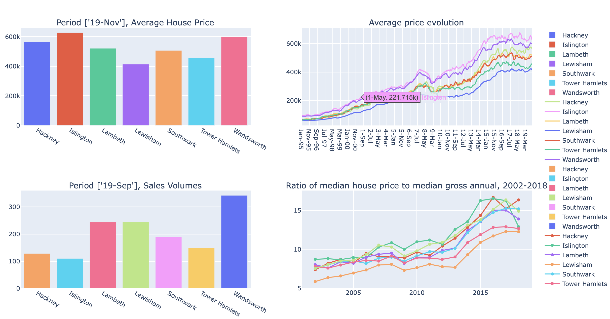

# property_price_london

This project was started to demonstrate the usage of python with pandas. 

There are four graph, three of them are built using official data published on [UK House Price Index(https://www.gov.uk/government/publications/about-the-uk-house-price-index)]
1. Average House Price:  the standard average house price is calculated by taking the average (geometric mean) price in January 2015 and then recalculating it in accordance with the index change back in time and forward to the present day.
2. Average price evolution
3. Sales Volumes for a given month
4. The forth graph is the Ratio of House Prices to Earnings (full-time workers by place of work)
This is the Annual Survey of Hours and Earnings (ASHE) is based on a 1 per cent sample of employee jobs. Information on earnings and hours is obtained in confidence from employers. It does not cover the self-employed nor does it cover employees not paid during the reference period. For more information, please visit [Office For National Statistics(https://www.ons.gov.uk/peoplepopulationandcommunity/housing/datasets/ratioofhousepricetoresidencebasedearningslowerquartileandmedian)]

## Prerequisites

Libraries: Pandas and Plotly
Python version: Python 2.7.16

## Graph example

